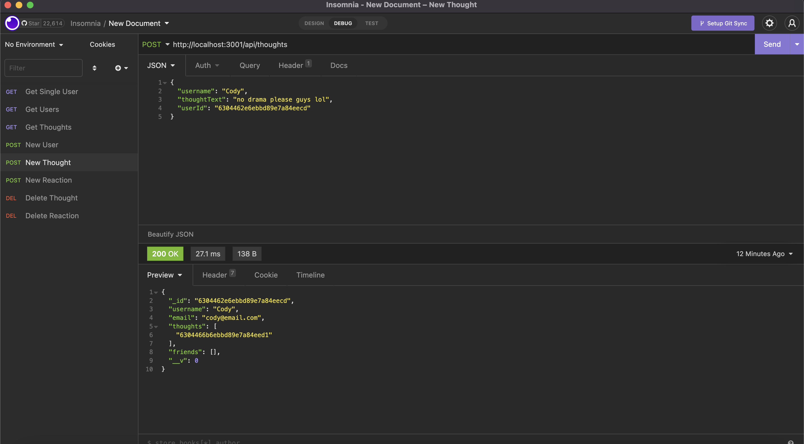

# Social Network Api

## Description 
The point of this application is to create a social network api for users to use CRUD operations for users, thoughts, and reactions. The database was created using mongoose and express. 

## Table of Contents

* [Installation](#installation)
* [Contribution](#contribution)
* [Video Demo](#video-demo)

## Installation 
To install this application you must first clone the repo to your local machine. Once the repo is cloned to your machine, you must then install the dependencies in your root directy after an NPM install. The dependencies needed are express and mongoose as seen in the video demo. Once the dependencies are installed you can run 'npm start' and open insomnia to test the application routes. 

## Contribution 
I utilized my tutor and referenced previous module work and lessons to complete this assignment. 

## Video-Demo
* Part 1: https://drive.google.com/file/d/1W7pr3_ajhpqWZjMMl7pVgUKadpoMyFc1/view
* Part 2: https://drive.google.com/file/d/1HgL0BVjInIcct7lruzYzDbqdQBiZEpn6/view

